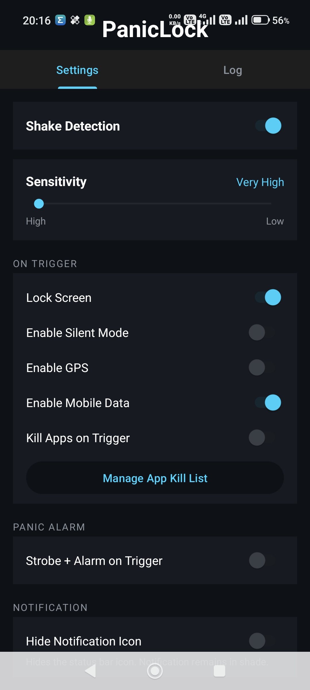
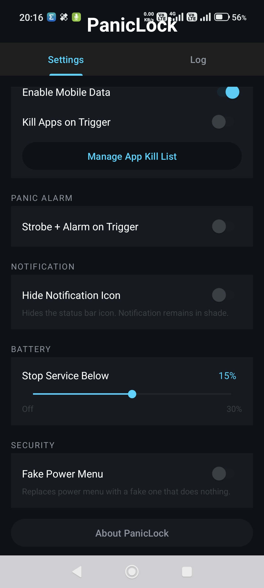
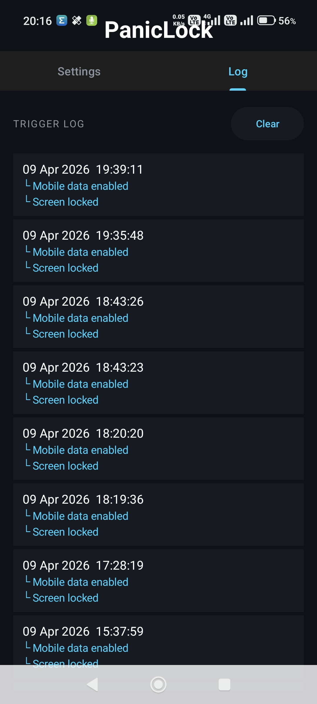

# PanicLock

A rooted Android security app that instantly locks your device when shaken — with remote control via Telegram.

## Screenshots

<p float="left">
  
  
  
</p>

## Features

- Shake detection with adjustable sensitivity (5 levels)
- Screen lock via root (KernelSU / Magisk)
- Enable GPS and mobile data on trigger
- Silent mode on trigger
- Force-stop selected apps on trigger
- Panic alarm — flashlight strobe + loud alarm sound with configurable duration
- Fake power menu overlay
- Trigger log — last 10 activations with timestamps and actions fired
- Battery auto-stop threshold
- Hide notification icon option
- Auto-starts on device reboot
- Minimal battery usage (2 samples/sec, sensor unregisters during cooldown)

## Telegram Bot Integration

PanicLock connects to a Telegram bot for two-way communication.

**Phone → Telegram:**
- Sends an alert with location and battery level when shake is detected
- Sends periodic location updates at a configurable interval (1, 2, 5, or 10 minutes)

**Telegram → Phone (remote commands):**

| Command | Action |
|---------|--------|
| `/locate` | Returns current GPS location as a Maps link |
| `/lock` | Locks the screen remotely |
| `/alarm` | Triggers the panic alarm (strobe + sound) |
| `/silent` | Enables silent mode |
| `/gps` | Enables GPS |
| `/data` | Enables mobile data |
| `/photo` | Takes a front camera photo and sends it |
| `/status` | Returns battery %, location, and service status |
| `/help` | Lists all available commands |

### Telegram Setup

1. Open Telegram → message **@BotFather** → send `/newbot` → follow prompts → copy the token
2. Start a chat with your new bot and send it any message
3. To get your Chat ID, message **@userinfobot** on Telegram — it replies instantly with your ID
4. Open PanicLock → scroll to **Telegram Bot** section → paste token and chat ID
5. Tap **Test Connection** — you should receive a confirmation message in Telegram

## Requirements

- Rooted Android device (KernelSU or Magisk)
- Android 8.0+ (API 26+)

## Installation

1. Download the latest APK from the [Releases](https://github.com/unicastbg/PanicLock/releases) page
2. Enable "Install from unknown sources" on your device
3. Install the APK and grant root access when prompted
4. Enable Shake Detection with the master toggle
5. Configure your preferred trigger actions

## Building from Source

```bash
git clone https://github.com/unicastbg/PanicLock.git
cd PanicLock
./gradlew assembleDebug
```

APK will be at `app/build/outputs/apk/debug/app-debug.apk`

## Project Structure

```
app/src/main/java/com/security/paniclock/
├── MainActivity.kt          # UI — Settings + Log tabs
├── ShakeDetector.kt         # Accelerometer shake logic
├── LockService.kt           # Foreground service, runs in background
├── TriggerActions.kt        # All on-trigger actions + log writing
├── TelegramBot.kt           # Telegram bot — send alerts + receive commands
├── BootReceiver.kt          # Auto-start on device reboot
├── PowerMenuReceiver.kt     # Fake power menu broadcast receiver
└── FakePowerMenuService.kt  # Fake power menu overlay
```

## Built With

Kotlin · Android SDK · KernelSU root · Telegram Bot API

## Credits

Developed by Svetoslav Izov  
with great help from Claude
